<!-- fis-analysis=ede099295479b3fb -->
<!-- fis-render=9630bb563599a259 -->
<!-- fis-runtime=python=3.12.13,numpy=2.5.2,pandas=3.0.5,scipy=1.18.0,scikit-learn=1.9.0,joblib=1.5.3,pyarrow=25.0.0,matplotlib=3.11.1 -->
<!-- fis-results=v1.16b25f07a0583641.ede099295479b3fb.869ccb52 -->
# Injection sensitivity

`fis-report`, 2026-08-29. 43,993 player-matches / 2,140 players; severity ladder k = (0.0, 1.0, 1.5, 3.0); bars at 1% and 5%; agreement matrices on `correlated:3`.

## Headline

**The best scorer depends on the manipulation** — recovery at the 1% bar, k=3:

| | single metric (`pass_completion`) | coordinated (all four) |
|---|---:|---:|
| max\|z\| | 325/2,140 (15.2%, auc 0.909) | 219/2,140 (10.2%, auc 0.905) |
| mahalanobis | 143/2,140 (6.7%, auc 0.918) | 251/2,140 (11.7%, auc 0.913) |
| forest | 23/2,140 (1.1%, auc 0.862) | 477/2,140 (22.3%, auc 0.868) |
| mahalanobis_res | 241/2,140 (11.3%, auc 0.911) | 313/2,140 (14.6%, auc 0.906) |
| forest_res | 0/2,140 (0.0%, auc 0.885) | 479/2,140 (22.4%, auc 0.911) |

The forests are weakest against a single metric and strongest against the coordinated one. On the coordinated injection the forest recovers **2.2× max|z|**. That is a statement about the bar, not about ranking: `mahalanobis` ranks perturbed rows above clean ones more reliably (auc 0.913 against `forest_res`'s 0.911), while `forest_res` moves fewer rows further past the cut.

<!-- fis-headline:end -->

**What the scorers see.** Six per-match metrics — `pass_completion_pct`, `defensive_action_success_pct`, `mean_action_x`, `passes_per_90`, `defensive_actions_per_90`, `touches_in_defensive_third_per_90` — or their leave-one-out per-player residuals: max|z| and the `_res` scorers read the residual z's, `mahalanobis` and `forest` the metric vector directly.

**Where the injection lands.** Never on those metrics: each mechanism moves hidden action counts — events a manipulator actually controls — and every metric is re-derived from what survives. What the scorer sees move is downstream of that:

| hidden variable moved | mechanism | what the scorer sees move |
|---|---|---|
| `defensive_actions` — the total, interceptions included | `remove_defensive` | `defensive_actions_per_90` ↓; the success rate is re-drawn over the survivors and barely shifts, because a hypergeometric removal takes successes in proportion |
| `touches_in_defensive_third` **and** the x-position of the player's actions (`sum_start_x_in_defensive_third`) — **two variables that can only move together**: a touch relocated out of the defensive third is, by identity, both one fewer touch there and more of the player's action mass further upfield | `relocate_upfield` | `touches_in_defensive_third_per_90` ↓ and `mean_action_x` ↑, jointly |
| `defensive_actions_successful` | `defensive_success` | `defensive_action_success_pct` ↓ (attempts frozen) |
| `passes_completed` | `pass_completion` | `pass_completion_pct` ↓ (`passes` volume frozen) |

Five hidden variables over four channels. They are not five independent knobs: the counts overlap by set membership — `defensive_actions_successful` nests inside `defensive_actions`, and about a quarter of defensive-third touches ARE defensive actions — so `remove_defensive` moves part of what the other channels control. The coordinated condition splits k across the four in quadrature and applies them in a fixed order, re-sizing each against the state the previous one left, rather than pretending they are simultaneous and independent. `throttle_defensive` drives the same variable as `defensive_success`, as a fraction of successes lost rather than k·σ, so it is excluded from the composition.

Calibration: every derived bar flags 1.00% of the clean census (largest deviation 0.0002%), so the recovery columns are read against a true base rate.

<b>DIRECT metric space</b>

max|z| is the simplest scorer, carried in both tables as the baseline the others have to beat.

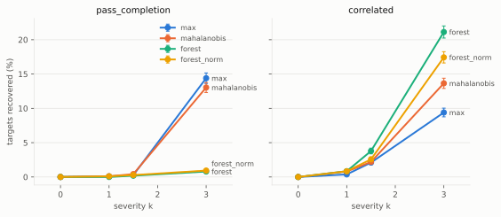

<b>relocate_upfield</b>

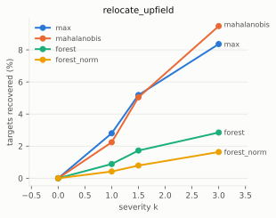

<b>remove_defensive</b>

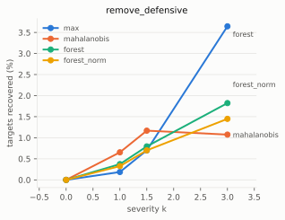

<b>defensive_success</b>

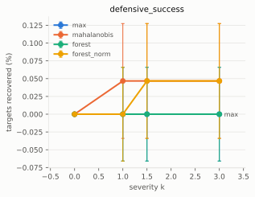

<b>throttle_defensive</b>

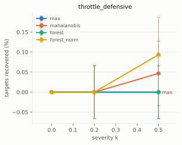

<b>raw table</b>

max|z| is the simplest scorer, carried in both tables as the baseline the others have to beat.

| scorer | injection | k | delivered | delivered z | n | dosed | auc | clipped | recovery @1% | recovery @5% | collateral |
|---|---|---:|---:|---:|---:|---:|---:|---:|---:|---:|---:|
| **max** | defensive_success | 0 | +0.00 sd | +0.00 | 2,140 | n/a | 0.500 | 0.0% | 0/2,140 ( 0.0%) | 0/2,140 ( 0.0%) | not measured |
|  | defensive_success | 1 | -0.61 sd | -0.49 | 2,140 | 1,257 | 0.515 | 5.9% | 0/2,140 ( 0.0%) → 0/1,257 ( 0.0%) | 6/2,140 ( 0.3%) → 6/1,257 ( 0.5%) | not measured |
|  | defensive_success | 1.5 | -0.85 sd | -0.68 | 2,140 | 1,349 | 0.540 | 15.2% | 0/2,140 ( 0.0%) → 0/1,349 ( 0.0%) | 18/2,140 ( 0.8%) → 18/1,349 ( 1.3%) | not measured |
|  | defensive_success | 3 | -1.22 sd | -0.98 | 2,140 | 1,401 | 0.598 | 47.9% | 0/2,140 ( 0.0%) → 0/1,401 ( 0.0%) | 43/2,140 ( 2.0%) → 43/1,401 ( 3.1%) | not measured |
|  | pass_completion | 0 | +0.00 sd | +0.00 | 2,140 | n/a | 0.500 | 0.0% | 0/2,140 ( 0.0%) | 0/2,140 ( 0.0%) | not measured |
|  | pass_completion | 1 | -1.00 sd | -0.79 | 2,140 | 2,109 | 0.596 | 0.0% | 1/2,140 ( 0.0%) → 1/2,109 ( 0.0%) | 33/2,140 ( 1.5%) → 33/2,109 ( 1.6%) | not measured |
|  | pass_completion | 1.5 | -1.50 sd | -1.18 | 2,140 | 2,128 | 0.670 | 0.0% | 11/2,140 ( 0.5%) → 11/2,128 ( 0.5%) | 158/2,140 ( 7.4%) → 158/2,128 ( 7.4%) | not measured |
|  | pass_completion | 3 | -2.99 sd | -2.34 | 2,140 | 2,138 | 0.909 | 0.3% | 325/2,140 (15.2%) → 325/2,138 (15.2%) | 907/2,140 (42.4%) → 907/2,138 (42.4%) | not measured |
|  | remove_defensive | 0 | +0.00 sd | +0.00 | 2,140 | n/a | 0.500 | 0.0% | 0/2,140 ( 0.0%) | 0/2,140 ( 0.0%) | not measured |
|  | remove_defensive | 1 | -0.91 sd | -0.96 | 2,140 | 2,060 | 0.594 | 10.9% | 5/2,140 ( 0.2%) → 5/2,060 ( 0.2%) | 98/2,140 ( 4.6%) → 98/2,060 ( 4.8%) | not measured |
|  | remove_defensive | 1.5 | -1.30 sd | -1.33 | 2,140 | 2,066 | 0.662 | 24.5% | 16/2,140 ( 0.7%) → 16/2,066 ( 0.8%) | 251/2,140 (11.7%) → 251/2,066 (12.1%) | not measured |
|  | remove_defensive | 3 | -1.99 sd | -1.97 | 2,140 | 2,066 | 0.855 | 66.3% | 80/2,140 ( 3.7%) → 80/2,066 ( 3.9%) | 618/2,140 (28.9%) → 618/2,066 (29.9%) | not measured |
|  | relocate_upfield | 0 | +0.00 sd | +0.00 | 2,140 | n/a | 0.500 | 0.0% | 0/2,140 ( 0.0%) | 0/2,140 ( 0.0%) | not measured |
|  | relocate_upfield | 1 | -0.89 sd | -0.84 | 2,140 | 2,058 | 0.596 | 15.3% | 60/2,140 ( 2.8%) → 60/2,058 ( 2.9%) | 130/2,140 ( 6.1%) → 130/2,058 ( 6.3%) | not measured |
|  | relocate_upfield | 1.5 | -1.25 sd | -1.15 | 2,140 | 2,058 | 0.652 | 27.9% | 111/2,140 ( 5.2%) → 111/2,058 ( 5.4%) | 220/2,140 (10.3%) → 220/2,058 (10.7%) | not measured |
|  | relocate_upfield | 3 | -1.96 sd | -1.76 | 2,140 | 2,058 | 0.789 | 64.5% | 179/2,140 ( 8.4%) → 179/2,058 ( 8.7%) | 458/2,140 (21.4%) → 458/2,058 (22.3%) | not measured |
|  | throttle_defensive | 0 | +0.00 sd | +0.00 | 2,140 | n/a | 0.500 | 0.0% | 0/2,140 ( 0.0%) | 0/2,140 ( 0.0%) | not measured |
|  | throttle_defensive | 0.2 | -0.22 sd | -0.17 | 2,140 | 552 | 0.490 | 0.0% | 0/2,140 ( 0.0%) → 0/552 ( 0.0%) | 0/2,140 ( 0.0%) → 0/552 ( 0.0%) | not measured |
|  | throttle_defensive | 0.5 | -0.55 sd | -0.45 | 2,140 | 1,033 | 0.506 | 0.0% | 0/2,140 ( 0.0%) → 0/1,033 ( 0.0%) | 1/2,140 ( 0.0%) → 1/1,033 ( 0.1%) | not measured |
|  | correlated | 0 | per-DOF | n/a | 2,140 | n/a | 0.500 | 0.0% | 0/2,140 ( 0.0%) | 0/2,140 ( 0.0%) | not measured |
|  | correlated | 1 | per-DOF | n/a | 2,140 | n/a | 0.627 | 0.0% | 16/2,140 ( 0.7%) [1 short] | 83/2,140 ( 3.9%) [1 short] | not measured |
|  | correlated | 1.5 | per-DOF | n/a | 2,140 | n/a | 0.708 | 0.0% | 59/2,140 ( 2.8%) [2 short] | 191/2,140 ( 8.9%) [2 short] | not measured |
|  | correlated | 3 | per-DOF | n/a | 2,140 | n/a | 0.905 | 0.0% | 219/2,140 (10.2%) [7 short] | 803/2,140 (37.5%) [7 short] | not measured |
| **mahalanobis** | defensive_success | 0 | +0.00 sd | +0.00 | 2,140 | n/a | 0.500 | 0.0% | 0/2,140 ( 0.0%) | 0/2,140 ( 0.0%) | not measured |
|  | defensive_success | 1 | -0.62 sd | -0.50 | 2,140 | 1,292 | 0.550 | 6.4% | 0/2,140 ( 0.0%) → 0/1,292 ( 0.0%) | 4/2,140 ( 0.2%) → 4/1,292 ( 0.3%) | not measured |
|  | defensive_success | 1.5 | -0.86 sd | -0.69 | 2,140 | 1,384 | 0.591 | 17.1% | 0/2,140 ( 0.0%) → 0/1,384 ( 0.0%) | 5/2,140 ( 0.2%) → 5/1,384 ( 0.4%) | not measured |
|  | defensive_success | 3 | -1.17 sd | -0.98 | 2,140 | 1,419 | 0.669 | 50.9% | 0/2,140 ( 0.0%) → 0/1,419 ( 0.0%) | 6/2,140 ( 0.3%) → 6/1,419 ( 0.4%) | not measured |
|  | pass_completion | 0 | +0.00 sd | +0.00 | 2,140 | n/a | 0.500 | 0.0% | 0/2,140 ( 0.0%) | 0/2,140 ( 0.0%) | not measured |
|  | pass_completion | 1 | -1.00 sd | -0.80 | 2,140 | 2,117 | 0.605 | 0.0% | 1/2,140 ( 0.0%) → 1/2,117 ( 0.0%) | 21/2,140 ( 1.0%) → 21/2,117 ( 1.0%) | not measured |
|  | pass_completion | 1.5 | -1.50 sd | -1.19 | 2,140 | 2,135 | 0.691 | 0.0% | 7/2,140 ( 0.3%) → 7/2,135 ( 0.3%) | 57/2,140 ( 2.7%) → 57/2,135 ( 2.7%) | not measured |
|  | pass_completion | 3 | -2.99 sd | -2.38 | 2,140 | 2,139 | 0.918 | 0.5% | 143/2,140 ( 6.7%) → 143/2,139 ( 6.7%) | 773/2,140 (36.1%) → 773/2,139 (36.1%) | not measured |
|  | remove_defensive | 0 | +0.00 sd | +0.00 | 2,140 | n/a | 0.500 | 0.0% | 0/2,140 ( 0.0%) | 0/2,140 ( 0.0%) | not measured |
|  | remove_defensive | 1 | -0.93 sd | -0.96 | 2,140 | 2,071 | 0.650 | 8.6% | 25/2,140 ( 1.2%) → 25/2,071 ( 1.2%) | 91/2,140 ( 4.3%) → 91/2,071 ( 4.4%) | not measured |
|  | remove_defensive | 1.5 | -1.32 sd | -1.34 | 2,140 | 2,075 | 0.728 | 21.7% | 16/2,140 ( 0.7%) → 16/2,075 ( 0.8%) | 123/2,140 ( 5.7%) → 123/2,075 ( 5.9%) | not measured |
|  | remove_defensive | 3 | -2.07 sd | -2.04 | 2,140 | 2,077 | 0.873 | 63.6% | 26/2,140 ( 1.2%) → 26/2,077 ( 1.3%) | 225/2,140 (10.5%) → 225/2,077 (10.8%) | not measured |
|  | relocate_upfield | 0 | +0.00 sd | +0.00 | 2,140 | n/a | 0.500 | 0.0% | 0/2,140 ( 0.0%) | 0/2,140 ( 0.0%) | not measured |
|  | relocate_upfield | 1 | -0.90 sd | -0.84 | 2,140 | 2,065 | 0.660 | 13.6% | 48/2,140 ( 2.2%) → 48/2,065 ( 2.3%) | 122/2,140 ( 5.7%) → 122/2,065 ( 5.9%) | not measured |
|  | relocate_upfield | 1.5 | -1.28 sd | -1.17 | 2,140 | 2,067 | 0.739 | 24.9% | 108/2,140 ( 5.0%) → 108/2,067 ( 5.2%) | 214/2,140 (10.0%) → 214/2,067 (10.4%) | not measured |
|  | relocate_upfield | 3 | -2.03 sd | -1.82 | 2,140 | 2,067 | 0.872 | 62.0% | 203/2,140 ( 9.5%) → 203/2,067 ( 9.8%) | 587/2,140 (27.4%) → 587/2,067 (28.4%) | not measured |
|  | throttle_defensive | 0 | +0.00 sd | +0.00 | 2,140 | n/a | 0.500 | 0.0% | 0/2,140 ( 0.0%) | 0/2,140 ( 0.0%) | not measured |
|  | throttle_defensive | 0.2 | -0.22 sd | -0.18 | 2,140 | 568 | 0.497 | 0.0% | 0/2,140 ( 0.0%) → 0/568 ( 0.0%) | 3/2,140 ( 0.1%) → 3/568 ( 0.5%) | not measured |
|  | throttle_defensive | 0.5 | -0.56 sd | -0.44 | 2,140 | 1,043 | 0.539 | 0.0% | 0/2,140 ( 0.0%) → 0/1,043 ( 0.0%) | 3/2,140 ( 0.1%) → 3/1,043 ( 0.3%) | not measured |
|  | correlated | 0 | per-DOF | n/a | 2,140 | n/a | 0.500 | 0.0% | 0/2,140 ( 0.0%) | 0/2,140 ( 0.0%) | not measured |
|  | correlated | 1 | per-DOF | n/a | 2,140 | n/a | 0.638 | 0.0% | 22/2,140 ( 1.0%) [1 short] | 83/2,140 ( 3.9%) [1 short] | not measured |
|  | correlated | 1.5 | per-DOF | n/a | 2,140 | n/a | 0.719 | 0.0% | 65/2,140 ( 3.0%) [1 short] | 206/2,140 ( 9.6%) [1 short] | not measured |
|  | correlated | 3 | per-DOF | n/a | 2,140 | n/a | 0.913 | 0.0% | 251/2,140 (11.7%) [3 short] | 839/2,140 (39.2%) [3 short] | not measured |
| **forest** | defensive_success | 0 | +0.00 sd | +0.00 | 2,140 | n/a | 0.500 | 0.0% | 0/2,140 ( 0.0%) | 0/2,140 ( 0.0%) | not measured |
|  | defensive_success | 1 | -0.65 sd | -0.52 | 2,140 | 1,358 | 0.504 | 6.8% | 0/2,140 ( 0.0%) → 0/1,358 ( 0.0%) | 4/2,140 ( 0.2%) → 4/1,358 ( 0.3%) | not measured |
|  | defensive_success | 1.5 | -0.91 sd | -0.72 | 2,140 | 1,468 | 0.527 | 17.5% | 0/2,140 ( 0.0%) → 0/1,468 ( 0.0%) | 7/2,140 ( 0.3%) → 7/1,468 ( 0.5%) | not measured |
|  | defensive_success | 3 | -1.24 sd | -1.01 | 2,140 | 1,505 | 0.580 | 54.2% | 0/2,140 ( 0.0%) → 0/1,505 ( 0.0%) | 10/2,140 ( 0.5%) → 10/1,505 ( 0.7%) | not measured |
|  | pass_completion | 0 | +0.00 sd | +0.00 | 2,140 | n/a | 0.500 | 0.0% | 0/2,140 ( 0.0%) | 0/2,140 ( 0.0%) | not measured |
|  | pass_completion | 1 | -1.00 sd | -0.80 | 2,140 | 2,111 | 0.581 | 0.0% | 4/2,140 ( 0.2%) → 4/2,111 ( 0.2%) | 25/2,140 ( 1.2%) → 25/2,111 ( 1.2%) | not measured |
|  | pass_completion | 1.5 | -1.50 sd | -1.20 | 2,140 | 2,132 | 0.661 | 0.0% | 7/2,140 ( 0.3%) → 7/2,132 ( 0.3%) | 49/2,140 ( 2.3%) → 49/2,132 ( 2.3%) | not measured |
|  | pass_completion | 3 | -2.99 sd | -2.38 | 2,140 | 2,139 | 0.862 | 0.4% | 23/2,140 ( 1.1%) → 23/2,139 ( 1.1%) | 224/2,140 (10.5%) → 224/2,139 (10.5%) | not measured |
|  | remove_defensive | 0 | +0.00 sd | +0.00 | 2,140 | n/a | 0.500 | 0.0% | 0/2,140 ( 0.0%) | 0/2,140 ( 0.0%) | not measured |
|  | remove_defensive | 1 | -0.93 sd | -0.97 | 2,140 | 2,075 | 0.611 | 8.6% | 8/2,140 ( 0.4%) → 8/2,075 ( 0.4%) | 84/2,140 ( 3.9%) → 84/2,075 ( 4.0%) | not measured |
|  | remove_defensive | 1.5 | -1.33 sd | -1.37 | 2,140 | 2,081 | 0.691 | 19.5% | 15/2,140 ( 0.7%) → 15/2,081 ( 0.7%) | 162/2,140 ( 7.6%) → 162/2,081 ( 7.8%) | not measured |
|  | remove_defensive | 3 | -2.11 sd | -2.09 | 2,140 | 2,081 | 0.860 | 62.0% | 40/2,140 ( 1.9%) → 40/2,081 ( 1.9%) | 322/2,140 (15.0%) → 322/2,081 (15.5%) | not measured |
|  | relocate_upfield | 0 | +0.00 sd | +0.00 | 2,140 | n/a | 0.500 | 0.0% | 0/2,140 ( 0.0%) | 0/2,140 ( 0.0%) | not measured |
|  | relocate_upfield | 1 | -0.92 sd | -0.86 | 2,140 | 2,082 | 0.587 | 12.8% | 19/2,140 ( 0.9%) → 19/2,082 ( 0.9%) | 87/2,140 ( 4.1%) → 87/2,082 ( 4.2%) | not measured |
|  | relocate_upfield | 1.5 | -1.30 sd | -1.20 | 2,140 | 2,083 | 0.653 | 25.3% | 37/2,140 ( 1.7%) → 37/2,083 ( 1.8%) | 121/2,140 ( 5.7%) → 121/2,083 ( 5.8%) | not measured |
|  | relocate_upfield | 3 | -2.06 sd | -1.85 | 2,140 | 2,083 | 0.796 | 63.5% | 61/2,140 ( 2.9%) → 61/2,083 ( 2.9%) | 184/2,140 ( 8.6%) → 184/2,083 ( 8.8%) | not measured |
|  | throttle_defensive | 0 | +0.00 sd | +0.00 | 2,140 | n/a | 0.500 | 0.0% | 0/2,140 ( 0.0%) | 0/2,140 ( 0.0%) | not measured |
|  | throttle_defensive | 0.2 | -0.25 sd | -0.19 | 2,140 | 624 | 0.484 | 0.0% | 0/2,140 ( 0.0%) → 0/624 ( 0.0%) | 1/2,140 ( 0.0%) → 1/624 ( 0.2%) | not measured |
|  | throttle_defensive | 0.5 | -0.60 sd | -0.46 | 2,140 | 1,106 | 0.506 | 0.0% | 0/2,140 ( 0.0%) → 0/1,106 ( 0.0%) | 3/2,140 ( 0.1%) → 3/1,106 ( 0.3%) | not measured |
|  | correlated | 0 | per-DOF | n/a | 2,140 | n/a | 0.500 | 0.0% | 0/2,140 ( 0.0%) | 0/2,140 ( 0.0%) | not measured |
|  | correlated | 1 | per-DOF | n/a | 2,140 | n/a | 0.576 | 0.0% | 44/2,140 ( 2.1%) [1 short] | 150/2,140 ( 7.0%) [1 short] | not measured |
|  | correlated | 1.5 | per-DOF | n/a | 2,140 | n/a | 0.644 | 0.0% | 85/2,140 ( 4.0%) [1 short] | 299/2,140 (14.0%) [1 short] | not measured |
|  | correlated | 3 | per-DOF | n/a | 2,140 | n/a | 0.868 | 0.0% | 477/2,140 (22.3%) [7 short] | 956/2,140 (44.7%) [7 short] | not measured |
| **forest_norm** | defensive_success | 0 | +0.00 sd | +0.00 | 2,140 | n/a | 0.500 | 0.0% | 0/2,140 ( 0.0%) | 0/2,140 ( 0.0%) | not measured |
|  | defensive_success | 1 | -0.65 sd | -0.52 | 2,140 | 1,329 | 0.509 | 6.7% | 1/2,140 ( 0.0%) → 1/1,329 ( 0.1%) | 3/2,140 ( 0.1%) → 3/1,329 ( 0.2%) | not measured |
|  | defensive_success | 1.5 | -0.89 sd | -0.71 | 2,140 | 1,429 | 0.539 | 17.5% | 1/2,140 ( 0.0%) → 1/1,429 ( 0.1%) | 5/2,140 ( 0.2%) → 5/1,429 ( 0.3%) | not measured |
|  | defensive_success | 3 | -1.20 sd | -0.99 | 2,140 | 1,467 | 0.594 | 53.3% | 1/2,140 ( 0.0%) → 1/1,467 ( 0.1%) | 10/2,140 ( 0.5%) → 10/1,467 ( 0.7%) | not measured |
|  | pass_completion | 0 | +0.00 sd | +0.00 | 2,140 | n/a | 0.500 | 0.0% | 0/2,140 ( 0.0%) | 0/2,140 ( 0.0%) | not measured |
|  | pass_completion | 1 | -1.00 sd | -0.80 | 2,140 | 2,112 | 0.596 | 0.0% | 3/2,140 ( 0.1%) → 3/2,112 ( 0.1%) | 17/2,140 ( 0.8%) → 17/2,112 ( 0.8%) | not measured |
|  | pass_completion | 1.5 | -1.50 sd | -1.20 | 2,140 | 2,133 | 0.681 | 0.0% | 11/2,140 ( 0.5%) → 11/2,133 ( 0.5%) | 42/2,140 ( 2.0%) → 42/2,133 ( 2.0%) | not measured |
|  | pass_completion | 3 | -2.99 sd | -2.38 | 2,140 | 2,140 | 0.878 | 0.4% | 33/2,140 ( 1.5%) → 33/2,140 ( 1.5%) | 243/2,140 (11.4%) → 243/2,140 (11.4%) | not measured |
|  | remove_defensive | 0 | +0.00 sd | +0.00 | 2,140 | n/a | 0.500 | 0.0% | 0/2,140 ( 0.0%) | 0/2,140 ( 0.0%) | not measured |
|  | remove_defensive | 1 | -0.93 sd | -0.97 | 2,140 | 2,075 | 0.608 | 8.8% | 6/2,140 ( 0.3%) → 6/2,075 ( 0.3%) | 73/2,140 ( 3.4%) → 73/2,075 ( 3.5%) | not measured |
|  | remove_defensive | 1.5 | -1.33 sd | -1.36 | 2,140 | 2,081 | 0.685 | 20.7% | 9/2,140 ( 0.4%) → 9/2,081 ( 0.4%) | 134/2,140 ( 6.3%) → 134/2,081 ( 6.4%) | not measured |
|  | remove_defensive | 3 | -2.10 sd | -2.08 | 2,140 | 2,083 | 0.847 | 62.3% | 31/2,140 ( 1.4%) → 31/2,083 ( 1.5%) | 246/2,140 (11.5%) → 246/2,083 (11.8%) | not measured |
|  | relocate_upfield | 0 | +0.00 sd | +0.00 | 2,140 | n/a | 0.500 | 0.0% | 0/2,140 ( 0.0%) | 0/2,140 ( 0.0%) | not measured |
|  | relocate_upfield | 1 | -0.91 sd | -0.86 | 2,140 | 2,072 | 0.600 | 12.4% | 9/2,140 ( 0.4%) → 9/2,072 ( 0.4%) | 70/2,140 ( 3.3%) → 70/2,072 ( 3.4%) | not measured |
|  | relocate_upfield | 1.5 | -1.29 sd | -1.19 | 2,140 | 2,073 | 0.671 | 25.1% | 17/2,140 ( 0.8%) → 17/2,073 ( 0.8%) | 116/2,140 ( 5.4%) → 116/2,073 ( 5.6%) | not measured |
|  | relocate_upfield | 3 | -2.05 sd | -1.84 | 2,140 | 2,073 | 0.830 | 63.3% | 35/2,140 ( 1.6%) → 35/2,073 ( 1.7%) | 208/2,140 ( 9.7%) → 208/2,073 (10.0%) | not measured |
|  | throttle_defensive | 0 | +0.00 sd | +0.00 | 2,140 | n/a | 0.500 | 0.0% | 0/2,140 ( 0.0%) | 0/2,140 ( 0.0%) | not measured |
|  | throttle_defensive | 0.2 | -0.25 sd | -0.19 | 2,140 | 621 | 0.483 | 0.0% | 0/2,140 ( 0.0%) → 0/621 ( 0.0%) | 1/2,140 ( 0.0%) → 1/621 ( 0.2%) | not measured |
|  | throttle_defensive | 0.5 | -0.57 sd | -0.44 | 2,140 | 1,077 | 0.510 | 0.0% | 0/2,140 ( 0.0%) → 0/1,077 ( 0.0%) | 1/2,140 ( 0.0%) → 1/1,077 ( 0.1%) | not measured |
|  | correlated | 0 | per-DOF | n/a | 2,140 | n/a | 0.500 | 0.0% | 0/2,140 ( 0.0%) | 0/2,140 ( 0.0%) | not measured |
|  | correlated | 1 | per-DOF | n/a | 2,140 | n/a | 0.583 | 0.0% | 35/2,140 ( 1.6%) | 120/2,140 ( 5.6%) | not measured |
|  | correlated | 1.5 | per-DOF | n/a | 2,140 | n/a | 0.650 | 0.0% | 61/2,140 ( 2.9%) | 285/2,140 (13.3%) | not measured |
|  | correlated | 3 | per-DOF | n/a | 2,140 | n/a | 0.886 | 0.0% | 393/2,140 (18.4%) [6 short] | 933/2,140 (43.6%) [6 short] | not measured |

<b>RESIDUAL (z) space</b>

max|z| is the simplest scorer, carried in both tables as the baseline the others have to beat.

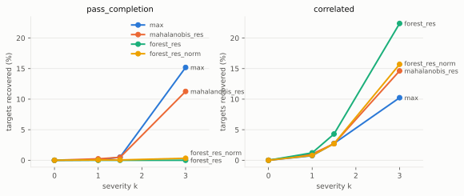

<b>relocate_upfield</b>

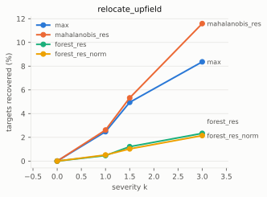

<b>remove_defensive</b>

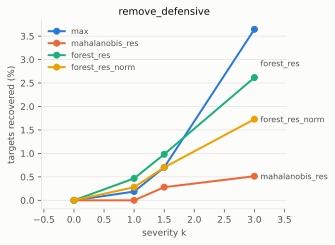

<b>defensive_success</b>

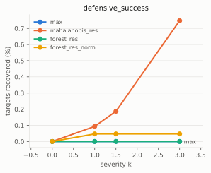

<b>throttle_defensive</b>

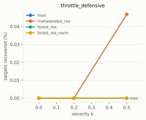

<b>raw table</b>

max|z| is the simplest scorer, carried in both tables as the baseline the others have to beat.

| scorer | injection | k | delivered | delivered z | n | dosed | auc | clipped | recovery @1% | recovery @5% | collateral |
|---|---|---:|---:|---:|---:|---:|---:|---:|---:|---:|---:|
| **max** | defensive_success | 0 | +0.00 sd | +0.00 | 2,140 | n/a | 0.500 | 0.0% | 0/2,140 ( 0.0%) | 0/2,140 ( 0.0%) | not measured |
|  | defensive_success | 1 | -0.61 sd | -0.49 | 2,140 | 1,257 | 0.515 | 5.9% | 0/2,140 ( 0.0%) → 0/1,257 ( 0.0%) | 6/2,140 ( 0.3%) → 6/1,257 ( 0.5%) | not measured |
|  | defensive_success | 1.5 | -0.85 sd | -0.68 | 2,140 | 1,349 | 0.540 | 15.2% | 0/2,140 ( 0.0%) → 0/1,349 ( 0.0%) | 18/2,140 ( 0.8%) → 18/1,349 ( 1.3%) | not measured |
|  | defensive_success | 3 | -1.22 sd | -0.98 | 2,140 | 1,401 | 0.598 | 47.9% | 0/2,140 ( 0.0%) → 0/1,401 ( 0.0%) | 43/2,140 ( 2.0%) → 43/1,401 ( 3.1%) | not measured |
|  | pass_completion | 0 | +0.00 sd | +0.00 | 2,140 | n/a | 0.500 | 0.0% | 0/2,140 ( 0.0%) | 0/2,140 ( 0.0%) | not measured |
|  | pass_completion | 1 | -1.00 sd | -0.79 | 2,140 | 2,109 | 0.596 | 0.0% | 1/2,140 ( 0.0%) → 1/2,109 ( 0.0%) | 33/2,140 ( 1.5%) → 33/2,109 ( 1.6%) | not measured |
|  | pass_completion | 1.5 | -1.50 sd | -1.18 | 2,140 | 2,128 | 0.670 | 0.0% | 11/2,140 ( 0.5%) → 11/2,128 ( 0.5%) | 158/2,140 ( 7.4%) → 158/2,128 ( 7.4%) | not measured |
|  | pass_completion | 3 | -2.99 sd | -2.34 | 2,140 | 2,138 | 0.909 | 0.3% | 325/2,140 (15.2%) → 325/2,138 (15.2%) | 907/2,140 (42.4%) → 907/2,138 (42.4%) | not measured |
|  | remove_defensive | 0 | +0.00 sd | +0.00 | 2,140 | n/a | 0.500 | 0.0% | 0/2,140 ( 0.0%) | 0/2,140 ( 0.0%) | not measured |
|  | remove_defensive | 1 | -0.91 sd | -0.96 | 2,140 | 2,060 | 0.594 | 10.9% | 5/2,140 ( 0.2%) → 5/2,060 ( 0.2%) | 98/2,140 ( 4.6%) → 98/2,060 ( 4.8%) | not measured |
|  | remove_defensive | 1.5 | -1.30 sd | -1.33 | 2,140 | 2,066 | 0.662 | 24.5% | 16/2,140 ( 0.7%) → 16/2,066 ( 0.8%) | 251/2,140 (11.7%) → 251/2,066 (12.1%) | not measured |
|  | remove_defensive | 3 | -1.99 sd | -1.97 | 2,140 | 2,066 | 0.855 | 66.3% | 80/2,140 ( 3.7%) → 80/2,066 ( 3.9%) | 618/2,140 (28.9%) → 618/2,066 (29.9%) | not measured |
|  | relocate_upfield | 0 | +0.00 sd | +0.00 | 2,140 | n/a | 0.500 | 0.0% | 0/2,140 ( 0.0%) | 0/2,140 ( 0.0%) | not measured |
|  | relocate_upfield | 1 | -0.89 sd | -0.84 | 2,140 | 2,058 | 0.596 | 15.3% | 60/2,140 ( 2.8%) → 60/2,058 ( 2.9%) | 130/2,140 ( 6.1%) → 130/2,058 ( 6.3%) | not measured |
|  | relocate_upfield | 1.5 | -1.25 sd | -1.15 | 2,140 | 2,058 | 0.652 | 27.9% | 111/2,140 ( 5.2%) → 111/2,058 ( 5.4%) | 220/2,140 (10.3%) → 220/2,058 (10.7%) | not measured |
|  | relocate_upfield | 3 | -1.96 sd | -1.76 | 2,140 | 2,058 | 0.789 | 64.5% | 179/2,140 ( 8.4%) → 179/2,058 ( 8.7%) | 458/2,140 (21.4%) → 458/2,058 (22.3%) | not measured |
|  | throttle_defensive | 0 | +0.00 sd | +0.00 | 2,140 | n/a | 0.500 | 0.0% | 0/2,140 ( 0.0%) | 0/2,140 ( 0.0%) | not measured |
|  | throttle_defensive | 0.2 | -0.22 sd | -0.17 | 2,140 | 552 | 0.490 | 0.0% | 0/2,140 ( 0.0%) → 0/552 ( 0.0%) | 0/2,140 ( 0.0%) → 0/552 ( 0.0%) | not measured |
|  | throttle_defensive | 0.5 | -0.55 sd | -0.45 | 2,140 | 1,033 | 0.506 | 0.0% | 0/2,140 ( 0.0%) → 0/1,033 ( 0.0%) | 1/2,140 ( 0.0%) → 1/1,033 ( 0.1%) | not measured |
|  | correlated | 0 | per-DOF | n/a | 2,140 | n/a | 0.500 | 0.0% | 0/2,140 ( 0.0%) | 0/2,140 ( 0.0%) | not measured |
|  | correlated | 1 | per-DOF | n/a | 2,140 | n/a | 0.627 | 0.0% | 16/2,140 ( 0.7%) [1 short] | 83/2,140 ( 3.9%) [1 short] | not measured |
|  | correlated | 1.5 | per-DOF | n/a | 2,140 | n/a | 0.708 | 0.0% | 59/2,140 ( 2.8%) [2 short] | 191/2,140 ( 8.9%) [2 short] | not measured |
|  | correlated | 3 | per-DOF | n/a | 2,140 | n/a | 0.905 | 0.0% | 219/2,140 (10.2%) [7 short] | 803/2,140 (37.5%) [7 short] | not measured |
| **mahalanobis_res** | defensive_success | 0 | +0.00 sd | +0.00 | 2,140 | n/a | 0.500 | 0.0% | 0/2,140 ( 0.0%) | 0/2,140 ( 0.0%) | not measured |
|  | defensive_success | 1 | -0.64 sd | -0.52 | 2,140 | 1,314 | 0.567 | 6.9% | 2/2,140 ( 0.1%) → 2/1,314 ( 0.2%) | 28/2,140 ( 1.3%) → 28/1,314 ( 2.1%) | not measured |
|  | defensive_success | 1.5 | -0.88 sd | -0.70 | 2,140 | 1,396 | 0.609 | 17.7% | 3/2,140 ( 0.1%) → 3/1,396 ( 0.2%) | 67/2,140 ( 3.1%) → 67/1,396 ( 4.8%) | not measured |
|  | defensive_success | 3 | -1.21 sd | -1.00 | 2,140 | 1,442 | 0.696 | 50.9% | 12/2,140 ( 0.6%) → 12/1,442 ( 0.8%) | 154/2,140 ( 7.2%) → 154/1,442 (10.7%) | not measured |
|  | pass_completion | 0 | +0.00 sd | +0.00 | 2,140 | n/a | 0.500 | 0.0% | 0/2,140 ( 0.0%) | 0/2,140 ( 0.0%) | not measured |
|  | pass_completion | 1 | -1.00 sd | -0.79 | 2,140 | 2,106 | 0.630 | 0.0% | 5/2,140 ( 0.2%) → 5/2,106 ( 0.2%) | 21/2,140 ( 1.0%) → 21/2,106 ( 1.0%) | not measured |
|  | pass_completion | 1.5 | -1.50 sd | -1.18 | 2,140 | 2,134 | 0.714 | 0.0% | 10/2,140 ( 0.5%) → 10/2,134 ( 0.5%) | 89/2,140 ( 4.2%) → 89/2,134 ( 4.2%) | not measured |
|  | pass_completion | 3 | -2.99 sd | -2.35 | 2,140 | 2,137 | 0.911 | 0.6% | 241/2,140 (11.3%) → 241/2,137 (11.3%) | 886/2,140 (41.4%) → 886/2,137 (41.5%) | not measured |
|  | remove_defensive | 0 | +0.00 sd | +0.00 | 2,140 | n/a | 0.500 | 0.0% | 0/2,140 ( 0.0%) | 0/2,140 ( 0.0%) | not measured |
|  | remove_defensive | 1 | -0.92 sd | -0.96 | 2,140 | 2,067 | 0.591 | 10.1% | 1/2,140 ( 0.0%) → 1/2,067 ( 0.0%) | 19/2,140 ( 0.9%) → 19/2,067 ( 0.9%) | not measured |
|  | remove_defensive | 1.5 | -1.31 sd | -1.34 | 2,140 | 2,069 | 0.668 | 21.3% | 4/2,140 ( 0.2%) → 4/2,069 ( 0.2%) | 40/2,140 ( 1.9%) → 40/2,069 ( 1.9%) | not measured |
|  | remove_defensive | 3 | -2.07 sd | -2.04 | 2,140 | 2,072 | 0.828 | 63.1% | 9/2,140 ( 0.4%) → 9/2,072 ( 0.4%) | 133/2,140 ( 6.2%) → 133/2,072 ( 6.4%) | not measured |
|  | relocate_upfield | 0 | +0.00 sd | +0.00 | 2,140 | n/a | 0.500 | 0.0% | 0/2,140 ( 0.0%) | 0/2,140 ( 0.0%) | not measured |
|  | relocate_upfield | 1 | -0.91 sd | -0.85 | 2,140 | 2,071 | 0.666 | 13.5% | 55/2,140 ( 2.6%) → 55/2,071 ( 2.7%) | 120/2,140 ( 5.6%) → 120/2,071 ( 5.8%) | not measured |
|  | relocate_upfield | 1.5 | -1.28 sd | -1.19 | 2,140 | 2,072 | 0.739 | 25.4% | 106/2,140 ( 5.0%) → 106/2,072 ( 5.1%) | 228/2,140 (10.7%) → 228/2,072 (11.0%) | not measured |
|  | relocate_upfield | 3 | -2.03 sd | -1.82 | 2,140 | 2,072 | 0.865 | 62.8% | 244/2,140 (11.4%) → 244/2,072 (11.8%) | 587/2,140 (27.4%) → 587/2,072 (28.3%) | not measured |
|  | throttle_defensive | 0 | +0.00 sd | +0.00 | 2,140 | n/a | 0.500 | 0.0% | 0/2,140 ( 0.0%) | 0/2,140 ( 0.0%) | not measured |
|  | throttle_defensive | 0.2 | -0.23 sd | -0.18 | 2,140 | 556 | 0.501 | 0.0% | 1/2,140 ( 0.0%) → 1/556 ( 0.2%) | 1/2,140 ( 0.0%) → 1/556 ( 0.2%) | not measured |
|  | throttle_defensive | 0.5 | -0.56 sd | -0.44 | 2,140 | 1,052 | 0.543 | 0.0% | 1/2,140 ( 0.0%) → 1/1,052 ( 0.1%) | 17/2,140 ( 0.8%) → 17/1,052 ( 1.6%) | not measured |
|  | correlated | 0 | per-DOF | n/a | 2,140 | n/a | 0.500 | 0.0% | 0/2,140 ( 0.0%) | 0/2,140 ( 0.0%) | not measured |
|  | correlated | 1 | per-DOF | n/a | 2,140 | n/a | 0.647 | 0.0% | 22/2,140 ( 1.0%) [2 short] | 70/2,140 ( 3.3%) [2 short] | not measured |
|  | correlated | 1.5 | per-DOF | n/a | 2,140 | n/a | 0.717 | 0.0% | 58/2,140 ( 2.7%) [2 short] | 183/2,140 ( 8.6%) [2 short] | not measured |
|  | correlated | 3 | per-DOF | n/a | 2,140 | n/a | 0.906 | 0.0% | 313/2,140 (14.6%) [6 short] | 884/2,140 (41.3%) [6 short] | not measured |
| **forest_res** | defensive_success | 0 | +0.00 sd | +0.00 | 2,140 | n/a | 0.500 | 0.0% | 0/2,140 ( 0.0%) | 0/2,140 ( 0.0%) | not measured |
|  | defensive_success | 1 | -0.65 sd | -0.50 | 2,140 | 1,318 | 0.552 | 6.4% | 0/2,140 ( 0.0%) → 0/1,318 ( 0.0%) | 2/2,140 ( 0.1%) → 2/1,318 ( 0.2%) | not measured |
|  | defensive_success | 1.5 | -0.89 sd | -0.69 | 2,140 | 1,412 | 0.587 | 17.9% | 0/2,140 ( 0.0%) → 0/1,412 ( 0.0%) | 4/2,140 ( 0.2%) → 4/1,412 ( 0.3%) | not measured |
|  | defensive_success | 3 | -1.21 sd | -0.96 | 2,140 | 1,461 | 0.653 | 52.4% | 0/2,140 ( 0.0%) → 0/1,461 ( 0.0%) | 5/2,140 ( 0.2%) → 5/1,461 ( 0.3%) | not measured |
|  | pass_completion | 0 | +0.00 sd | +0.00 | 2,140 | n/a | 0.500 | 0.0% | 0/2,140 ( 0.0%) | 0/2,140 ( 0.0%) | not measured |
|  | pass_completion | 1 | -1.00 sd | -0.79 | 2,140 | 2,099 | 0.604 | 0.0% | 0/2,140 ( 0.0%) → 0/2,099 ( 0.0%) | 6/2,140 ( 0.3%) → 6/2,099 ( 0.3%) | not measured |
|  | pass_completion | 1.5 | -1.49 sd | -1.17 | 2,140 | 2,123 | 0.697 | 0.1% | 0/2,140 ( 0.0%) → 0/2,123 ( 0.0%) | 16/2,140 ( 0.7%) → 16/2,123 ( 0.8%) | not measured |
|  | pass_completion | 3 | -2.99 sd | -2.35 | 2,140 | 2,138 | 0.885 | 0.7% | 0/2,140 ( 0.0%) → 0/2,138 ( 0.0%) | 100/2,140 ( 4.7%) → 100/2,138 ( 4.7%) | not measured |
|  | remove_defensive | 0 | +0.00 sd | +0.00 | 2,140 | n/a | 0.500 | 0.0% | 0/2,140 ( 0.0%) | 0/2,140 ( 0.0%) | not measured |
|  | remove_defensive | 1 | -0.94 sd | -0.98 | 2,140 | 2,099 | 0.587 | 10.0% | 15/2,140 ( 0.7%) → 15/2,099 ( 0.7%) | 79/2,140 ( 3.7%) → 79/2,099 ( 3.8%) | not measured |
|  | remove_defensive | 1.5 | -1.33 sd | -1.37 | 2,140 | 2,104 | 0.669 | 22.2% | 25/2,140 ( 1.2%) → 25/2,104 ( 1.2%) | 170/2,140 ( 7.9%) → 170/2,104 ( 8.1%) | not measured |
|  | remove_defensive | 3 | -2.08 sd | -2.06 | 2,140 | 2,107 | 0.859 | 64.9% | 61/2,140 ( 2.9%) → 61/2,107 ( 2.9%) | 387/2,140 (18.1%) → 387/2,107 (18.4%) | not measured |
|  | relocate_upfield | 0 | +0.00 sd | +0.00 | 2,140 | n/a | 0.500 | 0.0% | 0/2,140 ( 0.0%) | 0/2,140 ( 0.0%) | not measured |
|  | relocate_upfield | 1 | -0.90 sd | -0.85 | 2,140 | 2,068 | 0.610 | 14.0% | 9/2,140 ( 0.4%) → 9/2,068 ( 0.4%) | 82/2,140 ( 3.8%) → 82/2,068 ( 4.0%) | not measured |
|  | relocate_upfield | 1.5 | -1.27 sd | -1.18 | 2,140 | 2,069 | 0.674 | 26.7% | 23/2,140 ( 1.1%) → 23/2,069 ( 1.1%) | 135/2,140 ( 6.3%) → 135/2,069 ( 6.5%) | not measured |
|  | relocate_upfield | 3 | -2.02 sd | -1.81 | 2,140 | 2,069 | 0.806 | 63.6% | 50/2,140 ( 2.3%) → 50/2,069 ( 2.4%) | 255/2,140 (11.9%) → 255/2,069 (12.3%) | not measured |
|  | throttle_defensive | 0 | +0.00 sd | +0.00 | 2,140 | n/a | 0.500 | 0.0% | 0/2,140 ( 0.0%) | 0/2,140 ( 0.0%) | not measured |
|  | throttle_defensive | 0.2 | -0.24 sd | -0.18 | 2,140 | 582 | 0.493 | 0.0% | 0/2,140 ( 0.0%) → 0/582 ( 0.0%) | 0/2,140 ( 0.0%) → 0/582 ( 0.0%) | not measured |
|  | throttle_defensive | 0.5 | -0.54 sd | -0.42 | 2,140 | 1,027 | 0.528 | 0.0% | 0/2,140 ( 0.0%) → 0/1,027 ( 0.0%) | 1/2,140 ( 0.0%) → 1/1,027 ( 0.1%) | not measured |
|  | correlated | 0 | per-DOF | n/a | 2,140 | n/a | 0.500 | 0.0% | 0/2,140 ( 0.0%) | 0/2,140 ( 0.0%) | not measured |
|  | correlated | 1 | per-DOF | n/a | 2,140 | n/a | 0.606 | 0.0% | 26/2,140 ( 1.2%) | 125/2,140 ( 5.8%) | not measured |
|  | correlated | 1.5 | per-DOF | n/a | 2,140 | n/a | 0.684 | 0.0% | 92/2,140 ( 4.3%) [1 short] | 298/2,140 (13.9%) [1 short] | not measured |
|  | correlated | 3 | per-DOF | n/a | 2,140 | n/a | 0.911 | 0.0% | 479/2,140 (22.4%) [12 short] | 1,003/2,140 (46.9%) [12 short] | not measured |
| **forest_res_norm** | defensive_success | 0 | +0.00 sd | +0.00 | 2,140 | n/a | 0.500 | 0.0% | 0/2,140 ( 0.0%) | 0/2,140 ( 0.0%) | not measured |
|  | defensive_success | 1 | -0.62 sd | -0.50 | 2,140 | 1,275 | 0.551 | 6.2% | 1/2,140 ( 0.0%) → 1/1,275 ( 0.1%) | 2/2,140 ( 0.1%) → 2/1,275 ( 0.2%) | not measured |
|  | defensive_success | 1.5 | -0.87 sd | -0.69 | 2,140 | 1,386 | 0.589 | 17.8% | 1/2,140 ( 0.0%) → 1/1,386 ( 0.1%) | 3/2,140 ( 0.1%) → 3/1,386 ( 0.2%) | not measured |
|  | defensive_success | 3 | -1.19 sd | -0.97 | 2,140 | 1,428 | 0.662 | 51.1% | 1/2,140 ( 0.0%) → 1/1,428 ( 0.1%) | 10/2,140 ( 0.5%) → 10/1,428 ( 0.7%) | not measured |
|  | pass_completion | 0 | +0.00 sd | +0.00 | 2,140 | n/a | 0.500 | 0.0% | 0/2,140 ( 0.0%) | 0/2,140 ( 0.0%) | not measured |
|  | pass_completion | 1 | -1.00 sd | -0.79 | 2,140 | 2,095 | 0.610 | 0.0% | 1/2,140 ( 0.0%) → 1/2,095 ( 0.0%) | 7/2,140 ( 0.3%) → 7/2,095 ( 0.3%) | not measured |
|  | pass_completion | 1.5 | -1.50 sd | -1.18 | 2,140 | 2,127 | 0.702 | 0.1% | 1/2,140 ( 0.0%) → 1/2,127 ( 0.0%) | 18/2,140 ( 0.8%) → 18/2,127 ( 0.8%) | not measured |
|  | pass_completion | 3 | -2.98 sd | -2.34 | 2,140 | 2,138 | 0.887 | 0.7% | 7/2,140 ( 0.3%) → 7/2,138 ( 0.3%) | 116/2,140 ( 5.4%) → 116/2,138 ( 5.4%) | not measured |
|  | remove_defensive | 0 | +0.00 sd | +0.00 | 2,140 | n/a | 0.500 | 0.0% | 0/2,140 ( 0.0%) | 0/2,140 ( 0.0%) | not measured |
|  | remove_defensive | 1 | -0.93 sd | -0.97 | 2,140 | 2,086 | 0.572 | 10.3% | 7/2,140 ( 0.3%) → 7/2,086 ( 0.3%) | 46/2,140 ( 2.1%) → 46/2,086 ( 2.2%) | not measured |
|  | remove_defensive | 1.5 | -1.32 sd | -1.36 | 2,140 | 2,089 | 0.642 | 21.9% | 11/2,140 ( 0.5%) → 11/2,089 ( 0.5%) | 93/2,140 ( 4.3%) → 93/2,089 ( 4.5%) | not measured |
|  | remove_defensive | 3 | -2.07 sd | -2.05 | 2,140 | 2,091 | 0.813 | 63.8% | 35/2,140 ( 1.6%) → 35/2,091 ( 1.7%) | 220/2,140 (10.3%) → 220/2,091 (10.5%) | not measured |
|  | relocate_upfield | 0 | +0.00 sd | +0.00 | 2,140 | n/a | 0.500 | 0.0% | 0/2,140 ( 0.0%) | 0/2,140 ( 0.0%) | not measured |
|  | relocate_upfield | 1 | -0.90 sd | -0.85 | 2,140 | 2,054 | 0.627 | 13.7% | 8/2,140 ( 0.4%) → 8/2,054 ( 0.4%) | 57/2,140 ( 2.7%) → 57/2,054 ( 2.8%) | not measured |
|  | relocate_upfield | 1.5 | -1.27 sd | -1.18 | 2,140 | 2,056 | 0.695 | 25.8% | 18/2,140 ( 0.8%) → 18/2,056 ( 0.9%) | 108/2,140 ( 5.0%) → 108/2,056 ( 5.3%) | not measured |
|  | relocate_upfield | 3 | -2.01 sd | -1.81 | 2,140 | 2,056 | 0.830 | 62.9% | 44/2,140 ( 2.1%) → 44/2,056 ( 2.1%) | 253/2,140 (11.8%) → 253/2,056 (12.3%) | not measured |
|  | throttle_defensive | 0 | +0.00 sd | +0.00 | 2,140 | n/a | 0.500 | 0.0% | 0/2,140 ( 0.0%) | 0/2,140 ( 0.0%) | not measured |
|  | throttle_defensive | 0.2 | -0.23 sd | -0.18 | 2,140 | 573 | 0.490 | 0.0% | 0/2,140 ( 0.0%) → 0/573 ( 0.0%) | 1/2,140 ( 0.0%) → 1/573 ( 0.2%) | not measured |
|  | throttle_defensive | 0.5 | -0.54 sd | -0.44 | 2,140 | 1,032 | 0.532 | 0.0% | 0/2,140 ( 0.0%) → 0/1,032 ( 0.0%) | 0/2,140 ( 0.0%) → 0/1,032 ( 0.0%) | not measured |
|  | correlated | 0 | per-DOF | n/a | 2,140 | n/a | 0.500 | 0.0% | 0/2,140 ( 0.0%) | 0/2,140 ( 0.0%) | not measured |
|  | correlated | 1 | per-DOF | n/a | 2,140 | n/a | 0.609 | 0.0% | 17/2,140 ( 0.8%) | 94/2,140 ( 4.4%) | not measured |
|  | correlated | 1.5 | per-DOF | n/a | 2,140 | n/a | 0.688 | 0.0% | 58/2,140 ( 2.7%) [1 short] | 250/2,140 (11.7%) [1 short] | not measured |
|  | correlated | 3 | per-DOF | n/a | 2,140 | n/a | 0.911 | 0.0% | 336/2,140 (15.7%) [11 short] | 912/2,140 (42.6%) [11 short] | not measured |

<b>Target agreement (same match chosen)</b>

Independent of bar and dose. A gap in coverage is reported under the grid.

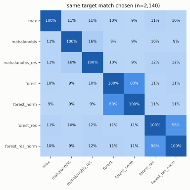

position GK (n=147)

| | max | mahalanobis | mahalanobis_res | forest | forest_norm | forest_res | forest_res_norm |
|---|---:|---:|---:|---:|---:|---:|---:|
| **max** | 100% (147) | 8% (147) | 7% (147) | 8% (147) | 7% (147) | 4% (147) | 10% (147) |
| **mahalanobis** | 8% (147) | 100% (147) | 19% (147) | 10% (147) | 6% (147) | 11% (147) | 10% (147) |
| **mahalanobis_res** | 7% (147) | 19% (147) | 100% (147) | 9% (147) | 6% (147) | 9% (147) | 14% (147) |
| **forest** | 8% (147) | 10% (147) | 9% (147) | 100% (147) | 57% (147) | 12% (147) | 7% (147) |
| **forest_norm** | 7% (147) | 6% (147) | 6% (147) | 57% (147) | 100% (147) | 13% (147) | 11% (147) |
| **forest_res** | 4% (147) | 11% (147) | 9% (147) | 12% (147) | 13% (147) | 100% (147) | 32% (147) |
| **forest_res_norm** | 10% (147) | 10% (147) | 14% (147) | 7% (147) | 11% (147) | 32% (147) | 100% (147) |

position DF (n=754)

| | max | mahalanobis | mahalanobis_res | forest | forest_norm | forest_res | forest_res_norm |
|---|---:|---:|---:|---:|---:|---:|---:|
| **max** | 100% (754) | 9% (754) | 12% (754) | 9% (754) | 10% (754) | 11% (754) | 11% (754) |
| **mahalanobis** | 9% (754) | 100% (754) | 19% (754) | 9% (754) | 9% (754) | 11% (754) | 11% (754) |
| **mahalanobis_res** | 12% (754) | 19% (754) | 100% (754) | 9% (754) | 8% (754) | 13% (754) | 12% (754) |
| **forest** | 9% (754) | 9% (754) | 9% (754) | 100% (754) | 70% (754) | 11% (754) | 11% (754) |
| **forest_norm** | 10% (754) | 9% (754) | 8% (754) | 70% (754) | 100% (754) | 10% (754) | 10% (754) |
| **forest_res** | 11% (754) | 11% (754) | 13% (754) | 11% (754) | 10% (754) | 100% (754) | 71% (754) |
| **forest_res_norm** | 11% (754) | 11% (754) | 12% (754) | 11% (754) | 10% (754) | 71% (754) | 100% (754) |

position MD (n=784)

| | max | mahalanobis | mahalanobis_res | forest | forest_norm | forest_res | forest_res_norm |
|---|---:|---:|---:|---:|---:|---:|---:|
| **max** | 100% (784) | 11% (784) | 13% (784) | 9% (784) | 9% (784) | 12% (784) | 12% (784) |
| **mahalanobis** | 11% (784) | 100% (784) | 19% (784) | 11% (784) | 10% (784) | 12% (784) | 12% (784) |
| **mahalanobis_res** | 13% (784) | 19% (784) | 100% (784) | 10% (784) | 9% (784) | 15% (784) | 14% (784) |
| **forest** | 9% (784) | 11% (784) | 10% (784) | 100% (784) | 71% (784) | 15% (784) | 13% (784) |
| **forest_norm** | 9% (784) | 10% (784) | 9% (784) | 71% (784) | 100% (784) | 14% (784) | 14% (784) |
| **forest_res** | 12% (784) | 12% (784) | 15% (784) | 15% (784) | 14% (784) | 100% (784) | 71% (784) |
| **forest_res_norm** | 12% (784) | 12% (784) | 14% (784) | 13% (784) | 14% (784) | 71% (784) | 100% (784) |

position FW (n=455)

| | max | mahalanobis | mahalanobis_res | forest | forest_norm | forest_res | forest_res_norm |
|---|---:|---:|---:|---:|---:|---:|---:|
| **max** | 100% (455) | 14% (455) | 12% (455) | 12% (455) | 13% (455) | 12% (455) | 11% (455) |
| **mahalanobis** | 14% (455) | 100% (455) | 18% (455) | 13% (455) | 12% (455) | 12% (455) | 12% (455) |
| **mahalanobis_res** | 12% (455) | 18% (455) | 100% (455) | 13% (455) | 11% (455) | 11% (455) | 11% (455) |
| **forest** | 12% (455) | 13% (455) | 13% (455) | 100% (455) | 65% (455) | 10% (455) | 11% (455) |
| **forest_norm** | 13% (455) | 12% (455) | 11% (455) | 65% (455) | 100% (455) | 11% (455) | 13% (455) |
| **forest_res** | 12% (455) | 12% (455) | 11% (455) | 10% (455) | 11% (455) | 100% (455) | 58% (455) |
| **forest_res_norm** | 11% (455) | 12% (455) | 11% (455) | 11% (455) | 13% (455) | 58% (455) | 100% (455) |

<b>Detection agreement (correlated, k=3, bar 1%)</b>

Cell = `|A∩B|/|A|` / Jaccard. Row A, column B: of the players A caught, the share B also caught. Asymmetric on purpose.

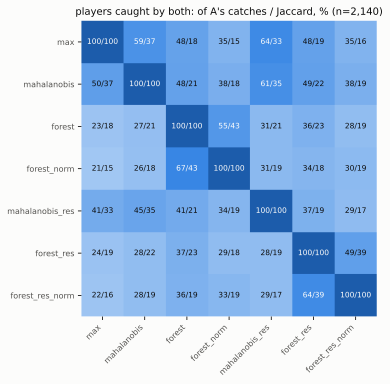

caught: max 219, mahalanobis 252, forest 477, forest_norm 393, mahalanobis_res 315, forest_res 479, forest_res_norm 336

position GK (n=147)

| | max | mahalanobis | forest | forest_norm | mahalanobis_res | forest_res | forest_res_norm |
|---|---:|---:|---:|---:|---:|---:|---:|
| **max** | 100%/100% | 92%/80% | 71%/64% | 48%/43% | 90%/80% | 65%/60% | 44%/42% |
| **mahalanobis** | 86%/80% | 100%/100% | 68%/62% | 52%/49% | 88%/82% | 64%/60% | 45%/44% |
| **forest** | 86%/64% | 88%/62% | 100%/100% | 67%/62% | 88%/65% | 64%/51% | 41%/34% |
| **forest_norm** | 80%/43% | 91%/49% | 91%/62% | 100%/100% | 91%/51% | 65%/42% | 55%/43% |
| **mahalanobis_res** | 88%/80% | 92%/82% | 71%/65% | 54%/51% | 100%/100% | 62%/56% | 45%/44% |
| **forest_res** | 89%/60% | 92%/60% | 71%/51% | 54%/42% | 86%/56% | 100%/100% | 57%/51% |
| **forest_res_norm** | 89%/42% | 95%/44% | 68%/34% | 66%/43% | 92%/44% | 84%/51% | 100%/100% |

caught: max 124, mahalanobis 132, forest 102, forest_norm 75, mahalanobis_res 126, forest_res 91, forest_res_norm 62

position DF (n=754)

| | max | mahalanobis | forest | forest_norm | mahalanobis_res | forest_res | forest_res_norm |
|---|---:|---:|---:|---:|---:|---:|---:|
| **max** | 100%/100% | 23%/9% | 35%/5% | 29%/5% | 39%/13% | 39%/6% | 32%/7% |
| **mahalanobis** | 13%/9% | 100%/100% | 40%/9% | 26%/7% | 30%/14% | 40%/10% | 45%/15% |
| **forest** | 6%/5% | 11%/9% | 100%/100% | 63%/53% | 13%/10% | 35%/22% | 27%/19% |
| **forest_norm** | 6%/5% | 9%/7% | 76%/53% | 100%/100% | 13%/10% | 29%/16% | 24%/15% |
| **mahalanobis_res** | 16%/13% | 21%/14% | 33%/10% | 28%/10% | 100%/100% | 35%/12% | 31%/12% |
| **forest_res** | 7%/6% | 12%/10% | 38%/22% | 26%/16% | 15%/12% | 100%/100% | 56%/47% |
| **forest_res_norm** | 8%/7% | 18%/15% | 39%/19% | 29%/15% | 17%/12% | 74%/47% | 100%/100% |

caught: max 31, mahalanobis 53, forest 191, forest_norm 160, mahalanobis_res 75, forest_res 175, forest_res_norm 132

position MD (n=784)

| | max | mahalanobis | forest | forest_norm | mahalanobis_res | forest_res | forest_res_norm |
|---|---:|---:|---:|---:|---:|---:|---:|
| **max** | 100%/100% | 20%/8% | 24%/4% | 24%/4% | 32%/9% | 28%/4% | 20%/4% |
| **mahalanobis** | 11%/8% | 100%/100% | 36%/9% | 22%/7% | 40%/18% | 27%/6% | 20%/6% |
| **forest** | 4%/4% | 11%/9% | 100%/100% | 57%/47% | 16%/12% | 32%/18% | 21%/14% |
| **forest_norm** | 5%/4% | 9%/7% | 73%/47% | 100%/100% | 15%/10% | 29%/14% | 23%/14% |
| **mahalanobis_res** | 11%/9% | 24%/18% | 31%/12% | 23%/10% | 100%/100% | 22%/7% | 18%/8% |
| **forest_res** | 4%/4% | 7%/6% | 29%/18% | 20%/14% | 10%/7% | 100%/100% | 53%/46% |
| **forest_res_norm** | 5%/4% | 8%/6% | 28%/14% | 24%/14% | 12%/8% | 77%/46% | 100%/100% |

caught: max 25, mahalanobis 45, forest 147, forest_norm 115, mahalanobis_res 74, forest_res 161, forest_res_norm 111

position FW (n=455)

| | max | mahalanobis | forest | forest_norm | mahalanobis_res | forest_res | forest_res_norm |
|---|---:|---:|---:|---:|---:|---:|---:|
| **max** | 100%/100% | 13%/9% | 8%/4% | 5%/2% | 23%/13% | 18%/8% | 8%/4% |
| **mahalanobis** | 23%/9% | 100%/100% | 9%/4% | 5%/2% | 14%/5% | 14%/4% | 9%/4% |
| **forest** | 8%/4% | 5%/4% | 100%/100% | 57%/36% | 8%/4% | 19%/9% | 8%/5% |
| **forest_norm** | 5%/2% | 2%/2% | 49%/36% | 100%/100% | 7%/4% | 26%/13% | 16%/10% |
| **mahalanobis_res** | 22%/13% | 8%/5% | 8%/4% | 8%/4% | 100%/100% | 18%/8% | 10%/6% |
| **forest_res** | 13%/8% | 6%/4% | 13%/9% | 21%/13% | 13%/8% | 100%/100% | 46%/41% |
| **forest_res_norm** | 10%/4% | 6%/4% | 10%/5% | 23%/10% | 13%/6% | 77%/41% | 100%/100% |

caught: max 39, mahalanobis 22, forest 37, forest_norm 43, mahalanobis_res 40, forest_res 52, forest_res_norm 31

<b>Collateral — what an injection does to the player's OTHER matches</b>

| scorer | injection | k | flagged before | after | net rows | moved | shift (sd) |
|---|---|---:|---:|---:|---:|---:|---:|
| **forest** | correlated | 1 | 1.05% | 1.07% | +9 | 92% | -0.0024 |
|  | correlated | 1.5 | 1.05% | 1.06% | +2 | 93% | -0.0032 |
|  | correlated | 3 | 1.05% | 1.02% | -15 | 93% | -0.0034 |
| **forest_norm** | correlated | 1 | 1.05% | 1.02% | -12 | 92% | -0.0004 |
|  | correlated | 1.5 | 1.05% | 1.01% | -17 | 92% | -0.0009 |
|  | correlated | 3 | 1.05% | 0.98% | -30 | 92% | -0.0067 |
| **forest_res** | correlated | 1 | 1.05% | 1.03% | -8 | 100% | -0.0035 |
|  | correlated | 1.5 | 1.05% | 1.06% | +2 | 100% | -0.0072 |
|  | correlated | 3 | 1.05% | 0.98% | -31 | 100% | -0.0170 |
| **forest_res_norm** | correlated | 1 | 1.05% | 0.99% | -27 | 100% | -0.0026 |
|  | correlated | 1.5 | 1.05% | 0.98% | -31 | 100% | -0.0061 |
|  | correlated | 3 | 1.05% | 0.95% | -44 | 100% | -0.0136 |
| **mahalanobis** | correlated | 1 | 1.05% | 1.00% | -21 | 92% | -0.0016 |
|  | correlated | 1.5 | 1.05% | 0.99% | -25 | 92% | -0.0040 |
|  | correlated | 3 | 1.05% | 0.97% | -33 | 92% | -0.0147 |
| **mahalanobis_res** | correlated | 1 | 1.05% | 1.01% | -15 | 100% | -0.0035 |
|  | correlated | 1.5 | 1.05% | 0.99% | -24 | 100% | -0.0068 |
|  | correlated | 3 | 1.05% | 0.97% | -34 | 100% | -0.0165 |
| **max** | correlated | 1 | 1.05% | 1.09% | +16 | 50% | -0.0065 |
|  | correlated | 1.5 | 1.05% | 1.09% | +17 | 56% | -0.0072 |
|  | correlated | 3 | 1.05% | 1.09% | +15 | 59% | -0.0112 |

Injecting one match barely moves the rest of the player's history. Over 63 measured conditions the largest median shift is **-0.0494 sd** (`max`, pass_completion k=3) against a 1% bar, and the flagged share of other matches stays within 0.88%–1.10% of a 1.05% baseline. Almost nothing crosses.

The shift is downward in 58 of 63 conditions. That is the expected direction: leaving a perturbed row in the player's history widens his own scale estimate, and a wider spread deflates every other row's z, so contamination makes the remaining matches look slightly LESS anomalous rather than more.

The flagged share still ticks up in 21 conditions, 12 of them `max` — it reads the MAXIMUM of six per-metric z's, so when the perturbed metric's z is deflated the maximum can simply move to another metric. The multivariate scorers have no such escape.

<b>Every other mechanism (scorers whose run covered the full grid)</b>

| scorer | injection | k | flagged before | after | net rows | moved | shift (sd) |
|---|---|---:|---:|---:|---:|---:|---:|
| **mahalanobis** | defensive_success | 1 | 1.05% | 1.07% | +9 | 60% | -0.0013 |
|  | defensive_success | 1.5 | 1.05% | 1.08% | +12 | 64% | -0.0023 |
|  | defensive_success | 3 | 1.05% | 1.07% | +8 | 65% | -0.0037 |
|  | pass_completion | 1 | 1.05% | 1.00% | -18 | 91% | -0.0002 |
|  | pass_completion | 1.5 | 1.05% | 0.99% | -25 | 92% | -0.0011 |
|  | pass_completion | 3 | 1.05% | 0.88% | -69 | 92% | -0.0069 |
|  | relocate_upfield | 1 | 1.05% | 1.01% | -15 | 89% | -0.0015 |
|  | relocate_upfield | 1.5 | 1.05% | 1.00% | -21 | 89% | -0.0028 |
|  | relocate_upfield | 3 | 1.05% | 0.96% | -35 | 89% | -0.0061 |
|  | remove_defensive | 1 | 1.05% | 1.01% | -14 | 92% | -0.0027 |
|  | remove_defensive | 1.5 | 1.05% | 1.00% | -18 | 92% | -0.0068 |
|  | remove_defensive | 3 | 1.05% | 1.03% | -8 | 92% | -0.0224 |
|  | throttle_defensive | 0.2 | 1.05% | 1.05% | +2 | 26% | -0.0003 |
|  | throttle_defensive | 0.5 | 1.05% | 1.07% | +11 | 48% | -0.0013 |
| **mahalanobis_res** | defensive_success | 1 | 1.05% | 1.04% | -4 | 61% | -0.0007 |
|  | defensive_success | 1.5 | 1.05% | 1.03% | -9 | 64% | -0.0012 |
|  | defensive_success | 3 | 1.05% | 1.02% | -13 | 66% | -0.0021 |
|  | pass_completion | 1 | 1.05% | 1.02% | -11 | 99% | -0.0006 |
|  | pass_completion | 1.5 | 1.05% | 1.00% | -21 | 100% | -0.0014 |
|  | pass_completion | 3 | 1.05% | 0.97% | -31 | 100% | -0.0056 |
|  | relocate_upfield | 1 | 1.05% | 1.02% | -11 | 97% | -0.0029 |
|  | relocate_upfield | 1.5 | 1.05% | 1.01% | -14 | 97% | -0.0049 |
|  | relocate_upfield | 3 | 1.05% | 0.98% | -27 | 97% | -0.0090 |
|  | remove_defensive | 1 | 1.05% | 1.02% | -10 | 94% | -0.0033 |
|  | remove_defensive | 1.5 | 1.05% | 1.03% | -8 | 94% | -0.0069 |
|  | remove_defensive | 3 | 1.05% | 1.03% | -5 | 94% | -0.0172 |
|  | throttle_defensive | 0.2 | 1.05% | 1.05% | +2 | 25% | -0.0001 |
|  | throttle_defensive | 0.5 | 1.05% | 1.03% | -6 | 48% | -0.0005 |
| **max** | defensive_success | 1 | 1.05% | 1.05% | +1 | 7% | +0.0232 |
|  | defensive_success | 1.5 | 1.05% | 1.05% | +1 | 7% | +0.0262 |
|  | defensive_success | 3 | 1.05% | 1.05% | +1 | 7% | +0.0298 |
|  | pass_completion | 1 | 1.05% | 1.05% | +0 | 18% | -0.0254 |
|  | pass_completion | 1.5 | 1.05% | 1.05% | -1 | 18% | -0.0352 |
|  | pass_completion | 3 | 1.05% | 1.04% | -3 | 19% | -0.0494 |
|  | relocate_upfield | 1 | 1.05% | 1.05% | +1 | 18% | -0.0108 |
|  | relocate_upfield | 1.5 | 1.05% | 1.06% | +3 | 19% | -0.0157 |
|  | relocate_upfield | 3 | 1.05% | 1.05% | -1 | 19% | -0.0226 |
|  | remove_defensive | 1 | 1.05% | 1.09% | +18 | 29% | -0.0030 |
|  | remove_defensive | 1.5 | 1.05% | 1.09% | +18 | 31% | -0.0043 |
|  | remove_defensive | 3 | 1.05% | 1.10% | +20 | 33% | -0.0054 |
|  | throttle_defensive | 0.2 | 1.05% | 1.05% | +1 | 3% | +0.0218 |
|  | throttle_defensive | 0.5 | 1.05% | 1.05% | +0 | 5% | +0.0247 |

<b>Notes</b>

- Population 43,993 rows / 2,140 players. **Observed, not certified-clean**, so base rates are upper bounds on FPR.
- Eligibility: ≥20 min baselines, ≥30 min evaluated (the mart's cut, read off this frame), ≥5 appearances.
- **Covariance shrinkage** `nu` 3.85–14.05 (GK 3.85, DF 14.05, MD 13.45, FW 9.06), the matches of evidence each position's covariance is worth. A player's own covariance carries weight n/(n+nu), so it takes over as his history lengthens rather than at a match-count threshold.
- **Two denominators.** `recovery` is over ALL attempted targets; the figure after `→` is the same numerator over `dosed` — rows the injection actually moved. A requested dose that rounds below one event is a real draw from the treatment and stays in the first; conditioning only on non-zero draws would select on the randomisation. **On the coordinated row it reads n/a**: 'some channel moved' is true on nearly every row and would imply a correction that was not made — there the per-channel `acted` shares carry it instead.
- **Recovery** is crossing the bar *because of* the injection (below when clean, above after). It is not the same as caught, which counts rows already flagged before anything was injected. Rates print as **recovered / targets**: the targets are the whole population — one injected row per player, chosen before anything was perturbed — so there is no sample and no interval to put on them.
- **The experiment is a scorer-relative typical-match challenge.** Each scorer's target is the match nearest that player's own median under that scorer — the same selection rule for every scorer, realised on different rows. The question each row answers is: injected into the kind of match this scorer finds unremarkable for this player, is the signal detected? The `delivered`/`delivered z` columns are the cross-scorer check that the different rows received comparable doses.
- **AUC is a cohort-referenced two-sample (Mann–Whitney) comparison** of the target cohort's clean and after distributions, ties counted half — not per-row pairs. It is threshold-free *at each specified dose*, so it is reported once rather than per rate. At k=0 the two multisets are identical, so the no-skill line is **exactly 0.5**, and the k=0 row measures that rather than setting it.
- **Do not compare mechanism rows as if they were equally injected.** `delivered` is the dose that actually landed, and it varies by mechanism: `pass_completion` delivers essentially all of what is asked and clips on no rows, while `remove_defensive` clips on most rows and lands under half. A mechanism that looks harder to detect may simply have been injected more weakly.
- **Clipped** is the share of injected targets whose dose was TRUNCATED — the mechanism ran out of successes to relabel, or actions to remove, or touches to relocate. Those rows received *less* than was asked for, so a miss there is delivery rather than detection. Read it beside the achieved dose, which says how much was actually delivered on average.
- Detection agreement is **one condition and the primary bar only**. Agreement rises with set size alone, so read the `caught` counts under each grid before reading the percentages. Note that k is split across channels on the coordinated condition (`compose` spends the quadratic budget equally until a channel reaches its capacity; capped channels take less and the remainder is redistributed to the uncapped ones, which therefore take MORE than k/√parts. The total reaches k unless every channel caps) — so a channel is not simply at k/√parts.
- Position grids resting on fewer than 10 players report a count instead of percentages. Below that, one player moves a cell by ten points.
- Bars are derived from this population at run time, never hardcoded.

